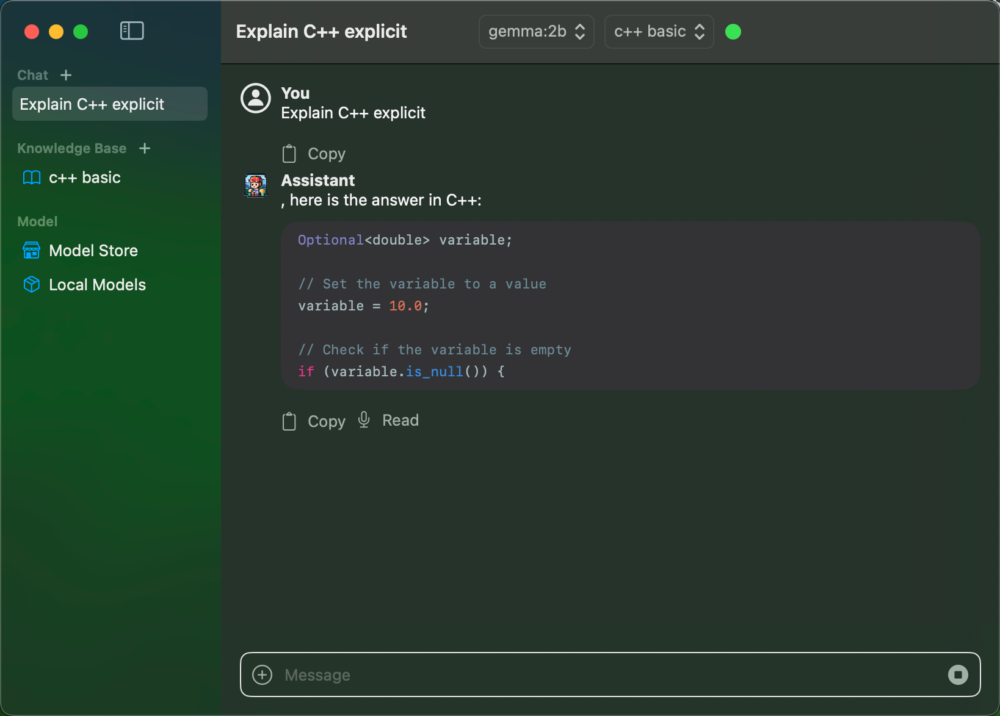
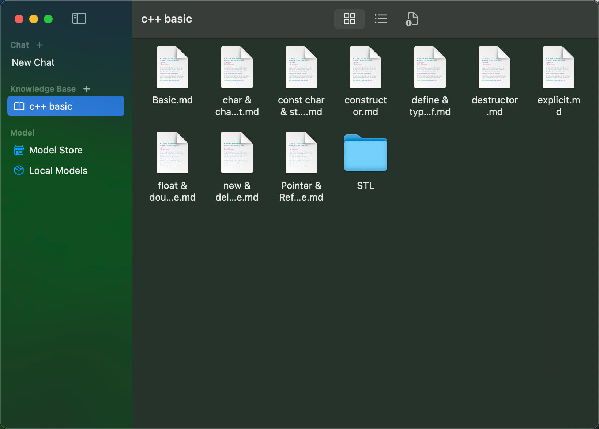
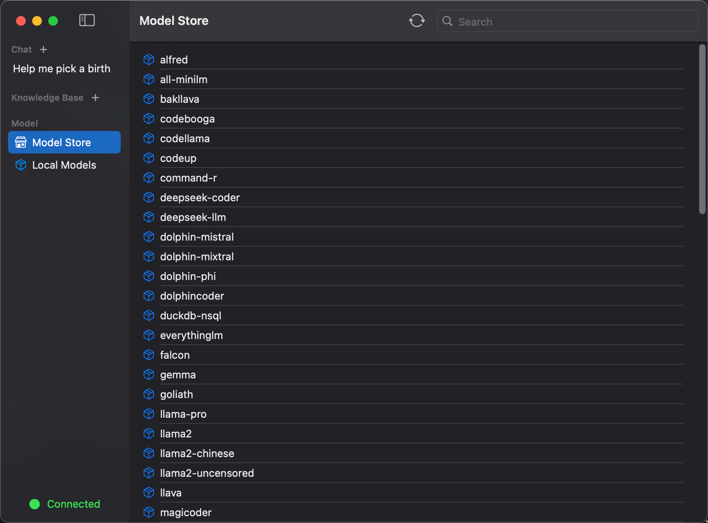

## 💡 What is ModelCraft ?

ModelCraft is a native RAG(Retrieval-Augmented Generation) app for macOS.  It offers the full chain path of chatting with models locally, from downloading models to building your knowledge base .

##  🚀  Get Started

No pre-operations. Just download the app to use it !

## :star:  Key Feature

### 🍩 Fine-tune the models to make model's answer precise and unbaised

###  🍔 Customize chat by selecting model and knowledge base.

### 🍞Customize your own knowledge base

- Supported file types,  pdf, xml, markdown, text, image. ( More file types will be supported in future )

### 🍰Download models from Model Store

- Download models with one-click

##  License

Distributed under the MIT License. See [`LICENSE`](./LICENSE) for more information.

