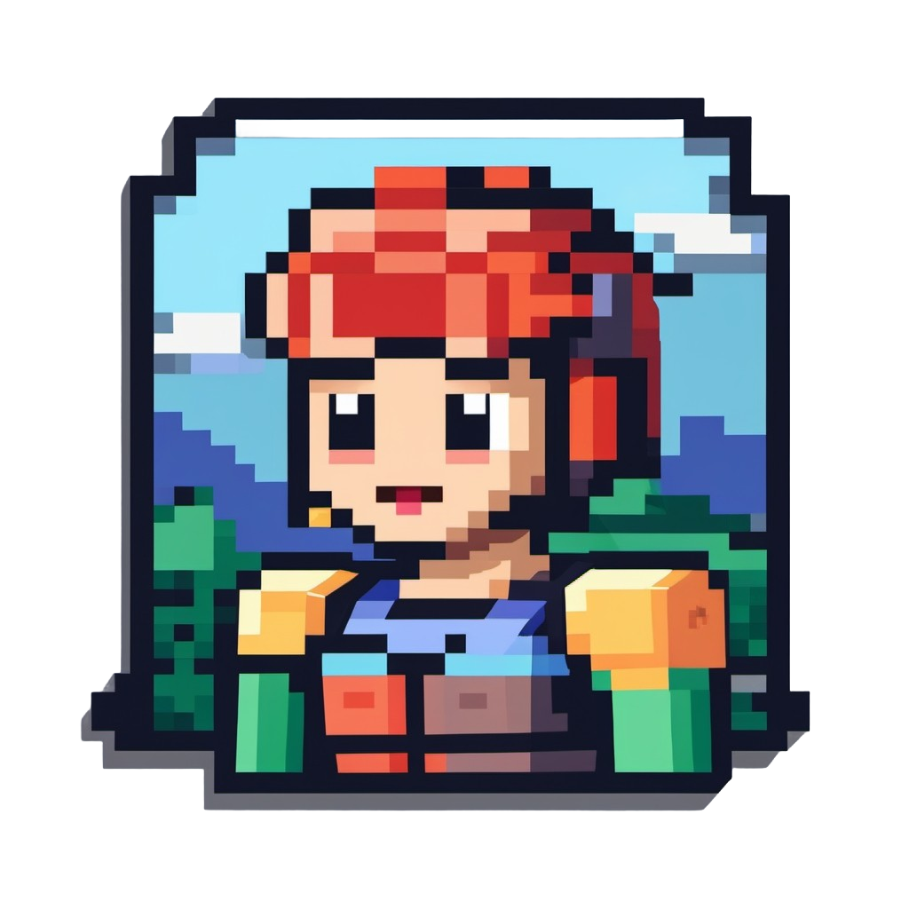
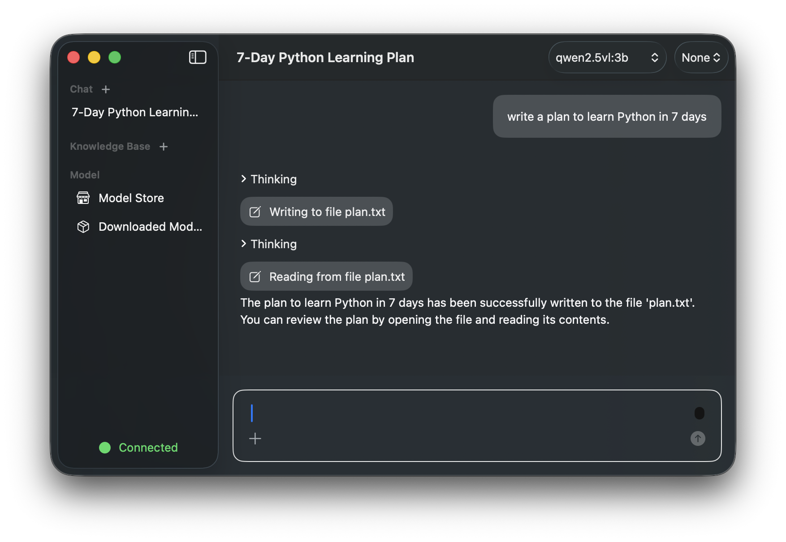
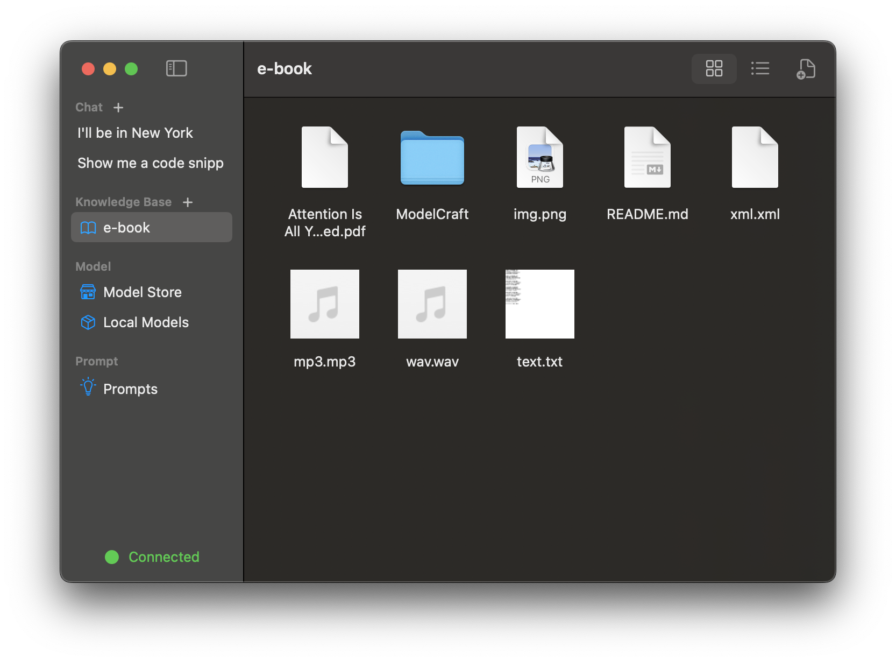
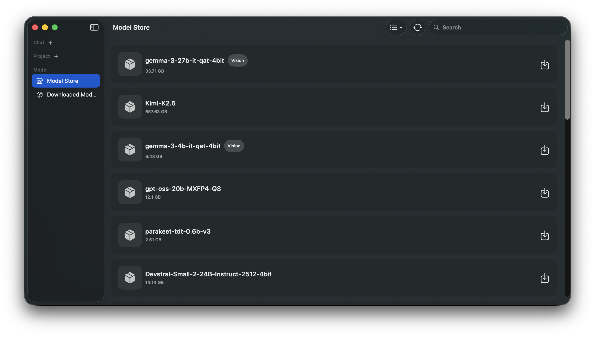

    

  
  

## 💡 What is ModelCraft?

**ModelCraft** is your personal, intelligent AI assistant designed exclusively for macOS. We bring the power of AI directly to your Mac, allowing you to seamlessly chat with advanced models, manage tasks, and organize your own knowledge base—all running locally on your device to keep your data completely private and secure.

## ✨ Why Choose ModelCraft?

- **Completely Private & Local:** Your data stays on your Mac. No need to upload your sensitive files or private chats to the cloud.
- **Ready to Use:** No complicated setup or coding required. Just download the app and start exploring!
- **Your Personal AI Library:** Easily build a customized knowledge base by simply dragging and dropping your own files.
- **Explore Powerful Models:** Discover and download top-tier AI models directly from the built-in Model Store.

## 🚀 Get Started

No complex configuration needed! 

1. **Download:** Get the latest version from our [Release Page](https://github.com/zhang-hongshen/ModelCraft/releases).
2. **Install:** Drag and drop the app into your Applications folder, and you're good to go!

*(Note: Homebrew installation is coming soon!)*

## 🌟 Key Features

🍔 **Smart Conversations:** Enjoy seamless chats tailored to your needs. Easily switch between different AI models and ask questions based on your personal knowledge bases.

🍞 **Build Your Knowledge Base:** Make the AI understand *your* context. Just add your own files—we currently support PDFs, text files, Markdown, XML, images, and audio. (More formats are on the way!)

🍰 **Built-in Model Store:** Browse and download powerful AI models like Qwen, DeepSeek, Mistral, and more with just one click. No technical hassle involved!

## 📸 Screenshots

<table width="100%">
  <tr>
    <td width="50%">
      <picture>
        <source media="(prefers-color-scheme: dark)" srcset="./assets/chat_dark.png">
        <source media="(prefers-color-scheme: light)" srcset="./assets/chat_light.png">
        
      </picture>
    </td>
    <td width="50%">
      <picture>
        <source media="(prefers-color-scheme: dark)" srcset="./assets/knowledge_base_dark.png">
        <source media="(prefers-color-scheme: light)" srcset="./assets/knowledge_base_light.png">
        
      </picture>
    </td>
  </tr>
  <tr>
    <td colspan="2" align="center">
       
      <picture>
        <source media="(prefers-color-scheme: dark)" srcset="./assets/model_store_dark.png">
        <source media="(prefers-color-scheme: light)" srcset="./assets/model_store_light.png">
        
      </picture>
    </td>
  </tr>
</table>

## 📄 Documentation

Want to learn more? Check out our user-friendly documentation [here](https://deepwiki.com/zhang-hongshen/ModelCraft).

## 📜 License

ModelCraft is freely available under the MIT License. See the [`LICENSE`](./LICENSE) file for more details.
