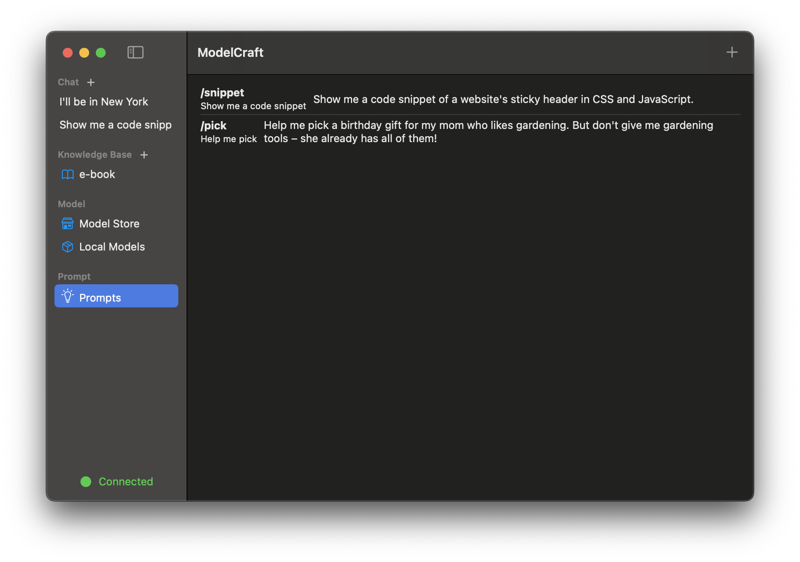

<div align="center"></div>

<div align="center" style="line-height: 1;">
  <a href="README_zh-CN.md" style="margin: 2px;">
    
  </a>  
</div>

<div align="center" style="line-height: 1;">
  <a href="https://github.com/zhang-hongshen/ModelCraft/LICENSE" style="margin: 2px;">
    
  </a>  
</div>

## 💡 What is ModelCraft ?

ModelCraft is a native RAG(Retrieval-Augmented Generation) app for macOS.  It offers the full chain path of chatting with models locally, from downloading models to building your knowledge base .

##  🚀  Get Started

No pre-operations. Just download the app to use it !

1. Download  latest Image from the [Release](https://github.com/zhang-hongshen/ModelCraft/releases) Page

2. Homebrew install（Not implemented yet QAQ ）

   ```shell
   brew install --cask modelcraft
   ```

## :star:  Key Feature

🍩 Fine-tune the models to make model's answer precise and unbaised

🍔 Customize chat by selecting model and knowledge base.

🍞Customize your own knowledge base. Supported file types include pdf, xml, markdown, text, image, audio. ( More file types will be supported in future )

🍰Download models from Model Store, including Deepseek, Llama, Mistral, Qwen and other powerful models.

🥜 Prompt Library

## :camera: Screenshot

<table>
  <tr>
    <td>
      <picture>
        <source media="(prefers-color-scheme: dark)" srcset="./assets/chat_dark.png">
        <source media="(prefers-color-scheme: light)" srcset="./assets/chat_light.png">
        
      </picture>
    </td>
    <td>
      <picture>
        <source media="(prefers-color-scheme: dark)" srcset="./assets/knowledge_base_dark.png">
        <source media="(prefers-color-scheme: light)" srcset="./assets/knowledge_base_light.png">
        
      </picture>
    </td>
  </tr>
  <tr>
    <td>
      <picture>
        <source media="(prefers-color-scheme: dark)" srcset="./assets/model_store_dark.png">
        <source media="(prefers-color-scheme: light)" srcset="./assets/model_store_light.png">
        
      </picture>
    </td>
    <td>
      <picture>
        <source media="(prefers-color-scheme: dark)" srcset="./assets/prompt_library_dark.png">
        <source media="(prefers-color-scheme: light)" srcset="./assets/prompt_library_light.png">
        
      </picture>
    </td>
  </tr>
</table>


## License

Distributed under the MIT License. See [`LICENSE`](./LICENSE) for more information.

