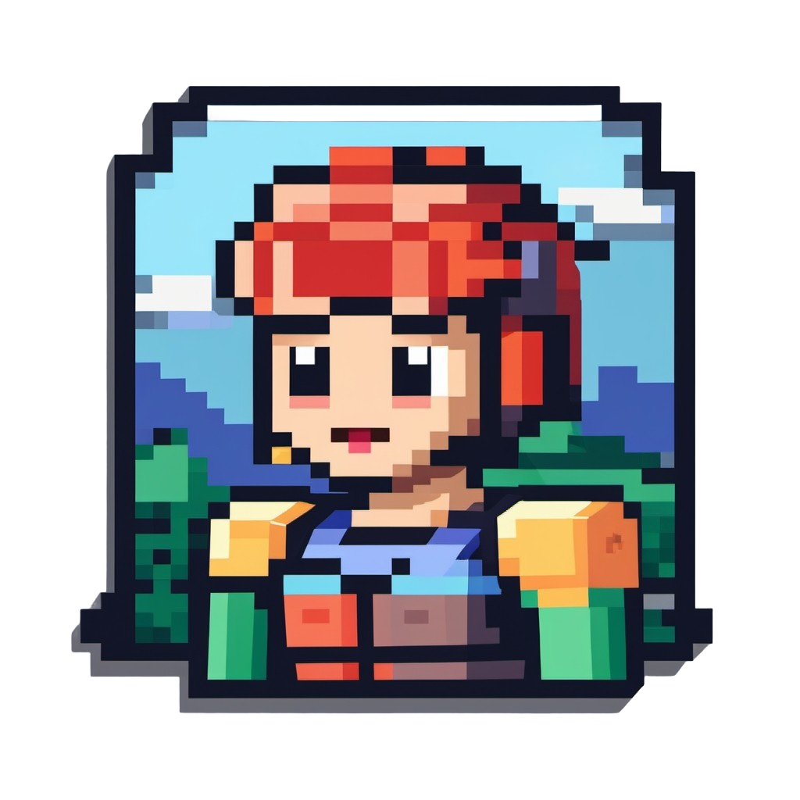
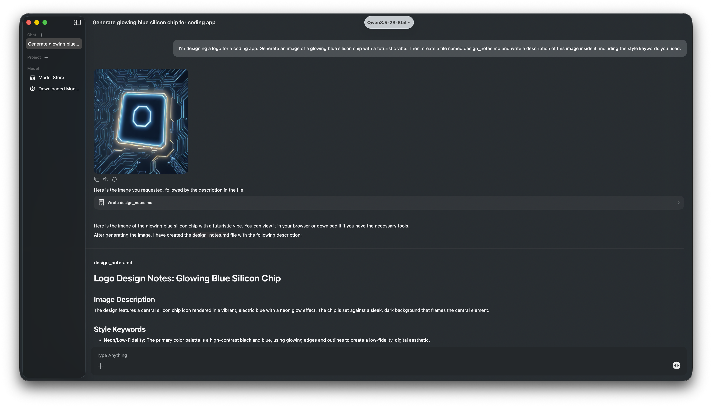
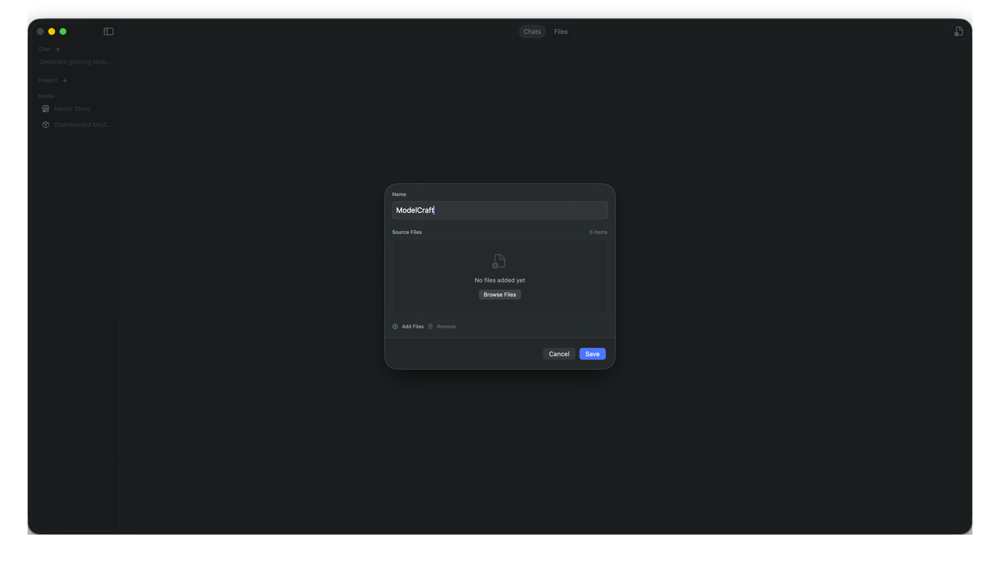
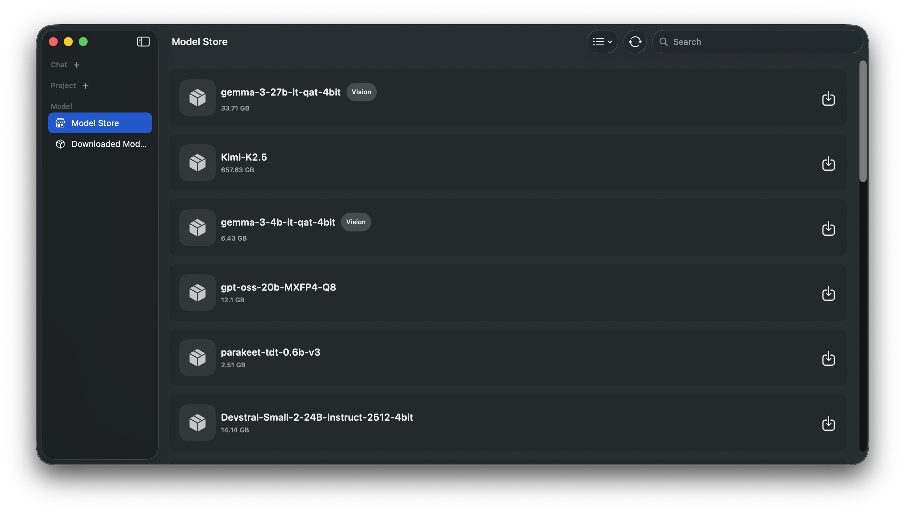

    

  
  

## 💡 ModelCraft 是什么？

**ModelCraft** 是一款**跨平台**的个人 AI 助手，支持 **Mac、iPhone 和 iPad**。同一款应用，多台设备随时使用——对话、整理项目、与 AI 协作。一切都在本地运行，对话与文件更安心。

ModelCraft 主打**多模态**体验：文字或语音交流、发送图片、阅读文档与音频、检索项目资料、根据描述生成图片……多种方式，一个助手。

## 💬 对话示例

一句话就能完成多件事——生成图片、写入文件、给出说明，全在同一次对话里：

> I'm designing a logo for a coding app. Generate an image of a glowing blue silicon chip with a futuristic vibe. Then, create a file named design_notes.md and write a description of this image inside it, including the style keywords you used.

<picture>
  <source media="(prefers-color-scheme: dark)" srcset="./assets/chat_dark.png">
  <source media="(prefers-color-scheme: light)" srcset="./assets/chat_light.png">
  
</picture>

## ✨ 为什么选择 ModelCraft？

- **覆盖你的 Apple 设备：** Mac、iPhone、iPad 都能用，在不同设备间无缝衔接。
- **真正的多模态：** 文字、语音、图片、文档与 AI 绘图，都能在同一次对话里完成。
- **本地隐私：** 数据留在你的设备上，上手即可使用，无需复杂配置。
- **开箱即用：** 下载、选模型、开聊，几步就能开始。
- **专属智库：** 用你自己的文件搭建项目知识库，随时切换模型。

## 🚀 快速开始

1. **下载：** 前往 [发布页面](https://github.com/zhang-hongshen/ModelCraft/releases) 获取最新版本。
2. **安装** 到你的 Mac、iPhone 或 iPad。
3. **打开模型商店，** 下载一个模型，即可开始对话。

*（Homebrew 安装方式正在开发中。）*

## 🌟 核心功能

🍔 **多模态对话：** 打字、说话、发图、传文件——AI 不只会读文字。可切换模型，并查看助手一步步完成任务。

🍞 **项目与知识库：** 把对话和资料收进项目。添加 PDF、笔记、图片、音频等，AI 能根据你放入的内容检索并回答。

🍰 **模型商店：** 在任意支持的设备上一键浏览、下载模型，下载过程可随时暂停与继续。

🤖 **Mac 上更省心：** 在 Mac 上，助手还能帮你处理更多实操类任务——操作文件、系统与屏幕，需要时搭把手。

## 📸 更多截图

<table width="100%">
  <tr>
    <td width="50%">
      <picture>
        <source media="(prefers-color-scheme: dark)" srcset="./assets/project_dark.png">
        <source media="(prefers-color-scheme: light)" srcset="./assets/project_light.png">
        
      </picture>
    </td>
    <td width="50%">
      <picture>
        <source media="(prefers-color-scheme: dark)" srcset="./assets/model_store_dark.png">
        <source media="(prefers-color-scheme: light)" srcset="./assets/model_store_light.png">
        
      </picture>
    </td>
  </tr>
</table>

## 📄 文档指南

想了解更多？欢迎查阅 [项目文档](https://deepwiki.com/zhang-hongshen/ModelCraft)。

## 📜 许可证

ModelCraft 采用 MIT 许可证开源。详见 [`LICENSE`](./LICENSE) 文件。
