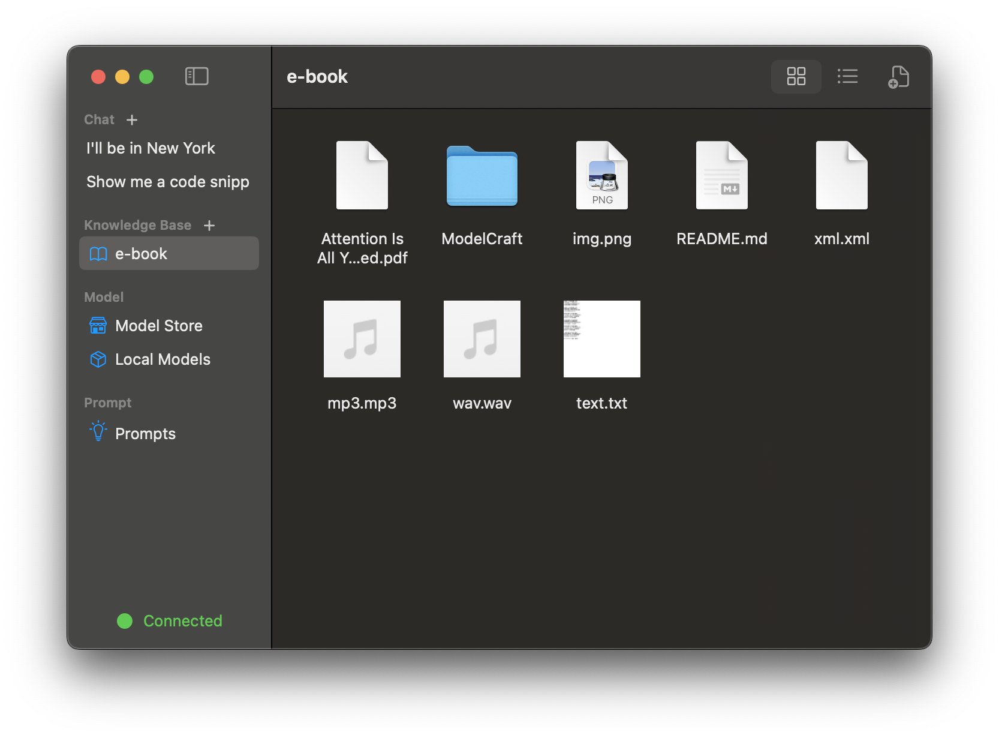
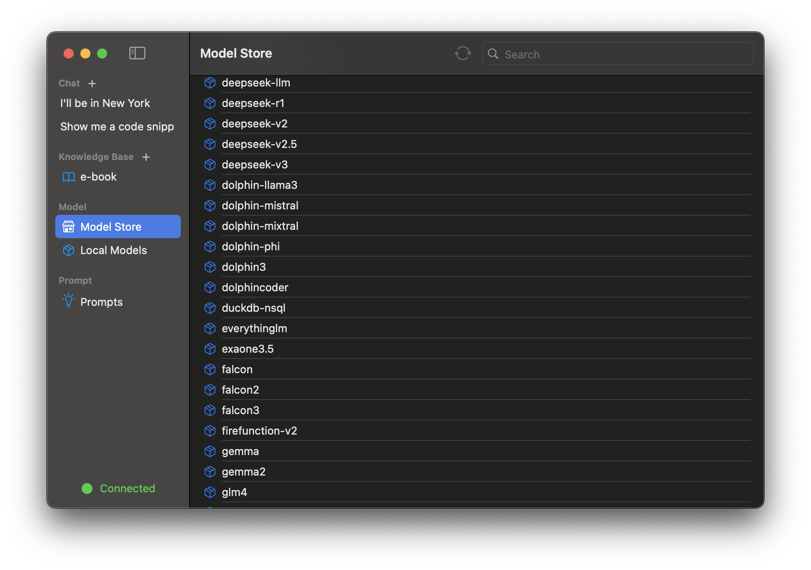

## 💡 ModelCraft是什么 ?

ModelCraft是一个原生的macOS RAG应用，提供了在本地使用大模型的全链路流程，从下载模型到构建知识库。

##  🚀  开始

没有任何前置操作，你只需要下载即可使用！

## :star:  关键功能

🍩 微调了相关模型使得回答更加准确和无偏见

🍔 通过选择模型和知识库定制您的对话

🍞自定义您的知识库， 支持的文件类型,  pdf, xml, markdown, text, 图片. ( 将来会支持更多的文件类型 )

🍰从模型商店中下载模型，支持Deepseek、Llama、Mistral、Qwen等模型。

🥜 提示词库

## :camera: 运行截图

<table>
  <tr>
    <td>
      <picture>
        <source media="(prefers-color-scheme: dark)" srcset="./assets/chat_dark.png">
        <source media="(prefers-color-scheme: light)" srcset="./assets/chat_light.png">
        
      </picture>
    </td>
    <td>
      <picture>
        <source media="(prefers-color-scheme: dark)" srcset="./assets/knowledge_base_dark.png">
        <source media="(prefers-color-scheme: light)" srcset="./assets/knowledge_base_light.png">
        
      </picture>
    </td>
  </tr>
  <tr>
    <td>
      <picture>
        <source media="(prefers-color-scheme: dark)" srcset="./assets/model_store_dark.png">
        <source media="(prefers-color-scheme: light)" srcset="./assets/model_store_light.png">
        
      </picture>
    </td>
    <td>
      <picture>
        <source media="(prefers-color-scheme: dark)" srcset="./assets/prompt_library_dark.png">
        <source media="(prefers-color-scheme: light)" srcset="./assets/prompt_library_light.png">
        
      </picture>
    </td>
  </tr>
</table>

## 许可证

遵循 MIT 许可证. 查看 [许可证](./LICENSE) 了解更多信息.

