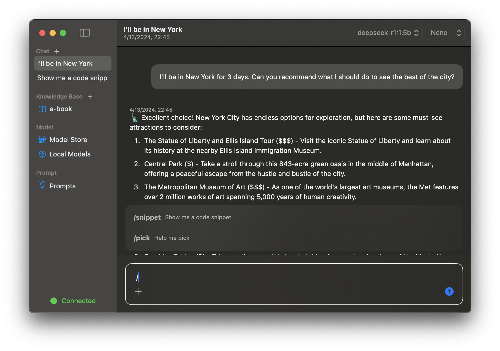

<div align="center"></div>

<div align="center" style="line-height: 1;">
  <a href="README.md" style="margin: 2px;">
    
  </a>  
</div>
<div align="center" style="line-height: 1;">
  <a href="https://github.com/zhang-hongshen/ModelCraft/LICENSE" style="margin: 2px;">
    
  </a>  
</div>

## 💡 ModelCraft 是什么 ?

ModelCraft 是一个为 MacOS 设计的智能体应用。

## 📄 **文档**

由AI驱动的项目文档可以在[这里](https://deepwiki.com/zhang-hongshen/ModelCraft)查看！

##  🚀  开始

没有任何前置操作，你只需要下载即可使用！

1. 从[发行](https://github.com/zhang-hongshen/ModelCraft/releases)页面下载

2. 通过Homebrew下载（还没实现 QAQ ）

   ```shell
   brew install --cask modelcraft
   ```

## :star:  关键功能

🍔 通过选择模型和知识库定制您的对话

🍞自定义您的知识库。支持的文件类型包括 pdf, xml, markdown, text, 图片, 音频. ( 将来会支持更多的文件类型 )

🍰从模型商店中下载模型，支持 Qwen, Deepseek, Mistral等模型。

## :camera: 运行截图

<table>
  <tr>
    <td>
      <picture>
        <source media="(prefers-color-scheme: dark)" srcset="./assets/chat_dark.png">
        <source media="(prefers-color-scheme: light)" srcset="./assets/chat_light.png">
        
      </picture>
    </td>
    <td>
      <picture>
        <source media="(prefers-color-scheme: dark)" srcset="./assets/knowledge_base_dark.png">
        <source media="(prefers-color-scheme: light)" srcset="./assets/knowledge_base_light.png">
        
      </picture>
    </td>
  </tr>
  <tr>
    <td>
      <picture>
        <source media="(prefers-color-scheme: dark)" srcset="./assets/model_store_dark.png">
        <source media="(prefers-color-scheme: light)" srcset="./assets/model_store_light.png">
        
      </picture>
    </td>
    <td>
    </td>
  </tr>
</table>


## 许可证

遵循 MIT 许可证. 查看 [许可证](./LICENSE) 了解更多信息.

